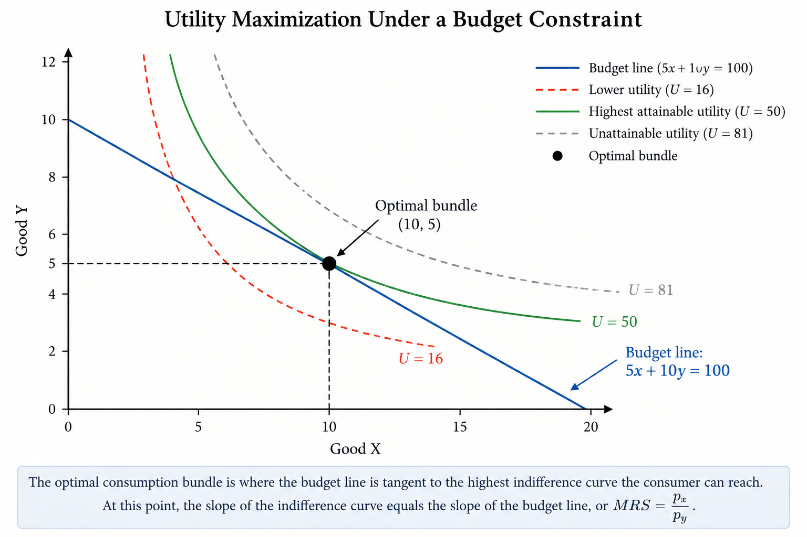

---
title: "Where Does λ Come From? Understanding Lagrange Multipliers Intuitively"
subtitle: "Why an extra symbol appears in a problem that originally only had x and y"
author: "Yixuan Wang"
date: "2026-09-14"
categories:
  - Optimization
  - Economics
---

## Why Does $\lambda$ Suddenly Appear?

When I first learned about functions, I became used to seeing variables such as $x$ and $y$, and sometimes $z$ or other letters. These variables usually represent objects that already exist in the original problem. So even when more variables are introduced, I still understand what they represent.

However, when I first learned about Lagrange multipliers, I had a different question. If the original optimization problem only has $x$ and $y$, why does a new variable, $\lambda$, suddenly appear when we solve it? It is not a new good, and it is not something we were originally asked to choose. So why are we allowed to introduce $\lambda$, and what role does it actually play in the problem?

For me, the key to understanding Lagrange multipliers is not simply learning how to differentiate the Lagrangian. It is first understanding where this extra $\lambda$ comes from and why it is useful.

## A Simple Constrained Optimization Problem

To understand where $\lambda$ comes from, I first went back to the original problem before the Lagrange multiplier is introduced. At this point, the problem still looks familiar because the only things we need to choose are $x$ and $y$.

For example, suppose a consumer chooses two goods, $x$ and $y$, and wants to achieve the highest possible utility:

$$
\max_{x,y} U(x,y)
$$

If there were no limits, the consumer could simply keep choosing more of both goods. In reality, however, income is limited. If the prices of the two goods are $p_x$ and $p_y$, and the consumer has income $M$, then the choices must also satisfy the budget constraint:

$$
p_xx + p_yy = M
$$

Up to this point, nothing new has appeared. The variables $x$ and $y$ are still the actual choices made by the consumer, while $p_x$, $p_y$, and $M$ are given. The important difference is that the consumer is no longer asking only, “Which combination of $x$ and $y$ gives me the highest utility?” The real question is:

**Among all the combinations I can actually afford, which one gives me the highest utility?**

This changes the problem from ordinary optimization into **constrained optimization**. There is now both an objective we want to maximize and a constraint we are not allowed to violate.

This is where I started to see why an additional tool might be necessary. If $x$ and $y$ are still the only actual choices, then what exactly is $\lambda$ doing?

## What Is $\lambda$ Doing?

The easiest way for me to understand $\lambda$ is to stop thinking of it as another variable like $x$ or $y$.

The consumer is not free to choose any point. Because of the budget constraint,

$$
p_xx+p_yy=M,
$$

the consumer can only move along the budget line. The goal is to find the point on that line that gives the highest possible utility.

At the optimum, the budget line is tangent to the highest indifference curve the consumer can reach. At that point, the direction of the objective function and the direction of the constraint are aligned.

Mathematically, this relationship is written as

$$
\nabla U = \lambda \nabla g.
$$

Here, $\lambda$ is not another good or another choice. It is simply the proportionality factor that connects the objective function to the constraint at the optimum.

This is what made $\lambda$ easier for me to understand: it does not create a new economic choice. It helps describe how the original objective and the original constraint fit together at the best feasible point.

## Seeing the Intuition Graphically

The graphical view makes the idea easier to understand. Because of the budget constraint, the consumer cannot choose every possible combination of $x$ and $y$. The goal is to reach the highest indifference curve that is still affordable.

At the optimal point, the budget line is tangent to the highest attainable indifference curve. This means that their slopes are equal:

$$
MRS=\frac{p_x}{p_y}.
$$

The MRS represents the consumer's willingness to trade one good for another, while the price ratio represents the trade-off imposed by the market. At the optimum, these two trade-offs match.

## What Does $\lambda$ Actually Mean?

The Lagrange multiplier is more than a mathematical tool. It also tells us how valuable the constraint is.

Suppose the consumer's budget increases slightly, from $100 to $101. With the extra dollar, the consumer may be able to reach a slightly higher level of utility. The multiplier $\lambda$ measures how much the best possible outcome changes when the budget constraint is relaxed a little.

In this sense, $\lambda$ is often called the **shadow value** or **shadow price** of the constraint. A larger $\lambda$ means that relaxing the constraint is more valuable, while a smaller $\lambda$ means that an additional unit of the resource has less effect.

So $\lambda$ is not simply an extra symbol added to the equation. It tells us something economically meaningful about the value of having a little more of the limited resource.

## Why It Initially Feels Unintuitive

Lagrange multipliers initially feel confusing because $\lambda$ looks like a new variable that suddenly appears in a problem that originally only involved $x$ and $y$. The key is that $\lambda$ does not represent another choice. Instead, it is connected to the constraint and helps describe how the objective and the constraint interact at the optimum.

Once I stopped thinking of $\lambda$ as another variable like $x$ or $y$, the method became much easier to understand. It is not adding a new economic decision; it is helping us solve the original problem under a limitation.

## Takeaway

The Lagrange multiplier is not just a mathematical trick. It helps us solve an optimization problem when there is a constraint, and it also gives the constraint an economic meaning.

The main idea I would remember is simple: $x$ and $y$ are the choices, while $\lambda$ tells us how important the constraint is and how valuable it would be to relax that constraint slightly.