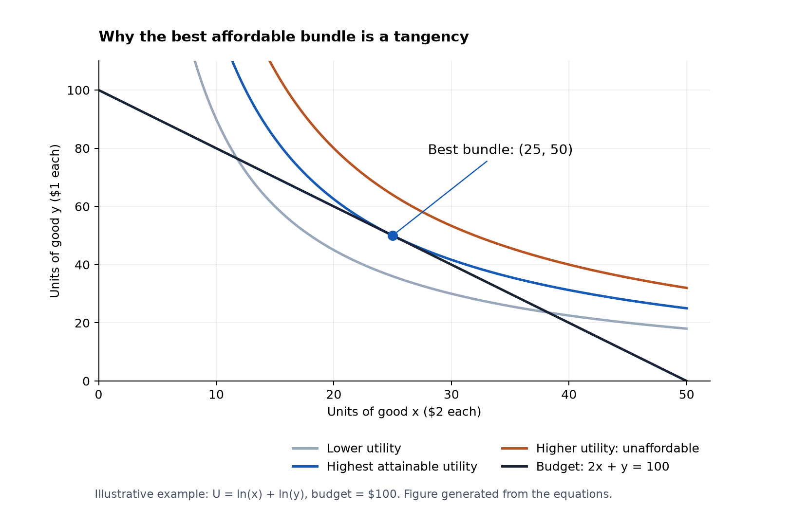

When I first encountered Lagrange multipliers, the most confusing part was the extra symbol. A consumer's problem began with two choices, $x$ and $y$, but its solution suddenly involved $\lambda$. Where did it come from? Was the consumer now choosing a third thing?

This question matters beyond a mathematics classroom. Consumers have limited income, firms have limited resources, and policymakers face limited budgets. We need a way to identify the best feasible choice and to ask how much an extra unit of a scarce resource would help. The multiplier connects these two questions.

Imagine choosing two goods. Good $x$ costs \$2 per unit, good $y$ costs \$1, and the budget is \$100. Suppose satisfaction is represented by $U(x,y)=\ln x+\ln y$, with positive quantities. Because more of either good increases satisfaction, the consumer spends the full budget:

$$
2x+y=100.
$$

A dollar spent on $x$ buys half a unit. Its extra satisfaction per dollar is therefore $1/(2x)$. A dollar spent on $y$ buys one unit, giving extra satisfaction of $1/y$. If one of these returns were higher, the consumer could improve the bundle by shifting a little spending toward that good while keeping total spending unchanged.

At the best interior bundle, those returns must match:

$$
\frac{1}{2x}=\frac{1}{y}.
$$

Combining this condition with the budget gives $x=25$ and $y=50$. Both goods deliver 0.02 units of additional satisfaction per dollar at that bundle. This common value is exactly $\lambda$.

The figure shows why this works geometrically. Moving along the budget line exchanges one unit of $x$ for two units of $y$. At the best bundle, the consumer's willingness to make that exchange matches the market's trade-off. The highest reachable indifference curve just touches the budget line. A lower curve leaves an opportunity to improve satisfaction; the higher curve is unaffordable.

The Lagrangian records this relationship in one expression:

$$
\mathcal L=\ln x+\ln y+\lambda(M-2x-y).
$$

The term in parentheses is the unspent budget. Differentiating gives $1/x=2\lambda$ and $1/y=\lambda$, along with the budget constraint. These conditions say that the marginal satisfaction from each good equals its price multiplied by the same value of money. Introducing $\lambda$ therefore does not create a third consumption choice. It supplies the unknown common value that makes the optimality conditions fit together.

Its economic meaning becomes clearer when the budget changes. In this example, the optimal choices for any positive budget $M$ are $x=M/4$ and $y=M/2$. Substituting them into utility gives

$$
U^*(M)=\ln(M/4)+\ln(M/2),\qquad
\frac{dU^*}{dM}=\frac{2}{M}=\lambda.
$$

At \$100, the multiplier is 0.02 utility units per dollar. Raising the budget to \$101 increases maximum utility by $2\ln(101/100)\approx0.0199$, close to the multiplier's local prediction. It is an approximation for a small change, rather than a guarantee about a large budget increase.

Two qualifications keep the intuition accurate. The tangency argument applies here because the optimum is interior and the objective is smooth and strictly concave; corner choices or nonsmooth preferences may require different conditions. Also, utility units are arbitrary. Multiplying the utility function by ten would multiply $\lambda$ by ten without changing the chosen bundle. Its numerical value is meaningful within the specified objective and constraint, rather than as a universal dollar price of happiness.

What initially looked like a mysterious new variable is a measure of scarcity:

- $x$ and $y$ describe the choices; $\lambda$ describes their common marginal return per dollar at the optimum.
- With this sign convention, $\lambda$ is the local increase in the best achievable utility from an extra dollar of budget.
- The multiplier's units and interpretation depend on how the objective and constraint are written.

[Figure equations and reproduction code](https://github.com/ywang818-max/website/tree/main/blog/posts/post1).
