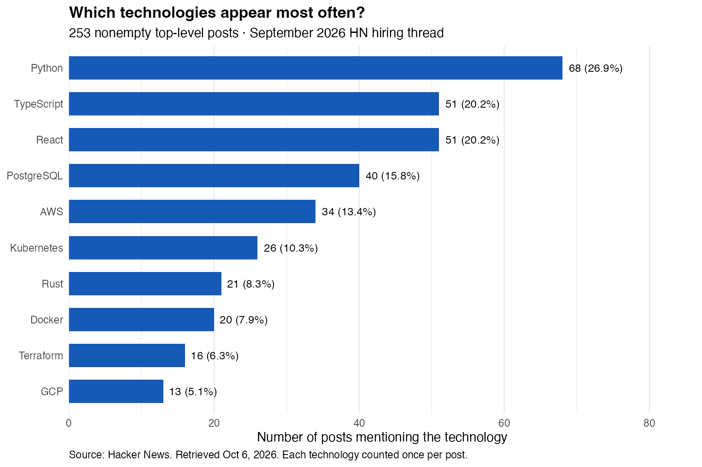

A job seeker can spend weeks learning a new technology without knowing whether it appears in the roles they want. The problem is not a shortage of learning resources; it is deciding where to invest limited time. Which technical skills appear most often in actual hiring posts, and how can that evidence guide a focused learning plan?

To explore that question, I examined the [September 2026 Hacker News “Who is hiring?” thread](https://news.ycombinator.com/item?id=49522897). It provides a useful view of employers speaking directly to a technology-oriented community. However, it is a particular recruiting channel, so its patterns should guide investigation of relevant roles rather than stand in for the entire labor market.

I collected the publicly accessible page using R's `rvest` package on October 6, 2026. Keeping nonempty top-level comments and excluding replies left 253 posts for analysis. Each post may advertise several jobs, so the unit counted here is a post, not an individual vacancy. I searched for 16 predefined technologies and counted each technology at most once per post. A post can mention several technologies, so the percentages do not add up to 100%.

Python led this list, appearing in 68 posts, or 26.9% of the sample. React and TypeScript followed with 51 mentions each, or 20.2%. PostgreSQL appeared in 40 posts, or 15.8%, and AWS in 34, or 13.4%. The remaining technologies were less common individually, but their presence shows that employers discuss a mix of programming languages, databases, and infrastructure.

These counts suggest a useful first step: identify a target role before choosing a technology to study. For someone considering web development, the React and TypeScript results offer a concrete pairing to investigate. They appeared together in 34 posts—34 of the 51 React posts and 34 of the 51 TypeScript posts. A small project that uses TypeScript to build a React interface could therefore demonstrate experience with a combination that repeatedly appears in this hiring channel. The next step is to inspect the actual web-development positions and check whether the combination is required or merely part of the company's stack.

For someone considering backend or data-related work, Python and PostgreSQL provide another candidate combination. They occurred together in 20 posts. A project that uses Python to work with a PostgreSQL database could demonstrate how programming and data storage connect. The evidence supports examining that combination; it does not establish that it is optimal for every backend or data job, since this analysis does not separately classify occupations.

The ranking is also useful for a resume review. Select several current postings that match your location, experience level, and desired role. Compare their requirements with projects you can honestly describe. If a recurring technology is missing, decide whether a focused project would close a relevant gap. Simply adding keywords without corresponding experience would not solve that problem.

Several limitations matter for this decision. A technology's mention may describe a company's existing system, an optional skill, or one role among several, rather than a mandatory requirement. Keyword matching can miss synonyms and does not measure proficiency: for example, this analysis matches Go conservatively through “golang,” so it undercounts posts that only say “Go.” The fixed technology list also leaves out many skills. None of these counts measures hiring success, salaries, or the return to learning a particular tool.

The thread can change as comments are added or removed. These revised results describe the October 6 snapshot, not the earlier collection used in the original post. Archived mention indicators and the analysis code preserve the revised counts for replication.

For a job seeker, the practical lesson is to use hiring text to narrow a learning plan, then verify the fit against specific positions:

- Python was the most common technology in the predefined list, appearing in 26.9% of analyzed posts.
- React with TypeScript and Python with PostgreSQL are recurring combinations worth investigating for relevant roles.
- Prioritize demonstrable skills for a target role; a mention ranking is a starting point, not a universal prescription.

[Source thread](https://news.ycombinator.com/item?id=49522897) · [Scraping code, mention data, and replication instructions](https://github.com/ywang818-max/website/tree/main/blog/posts/post2).
