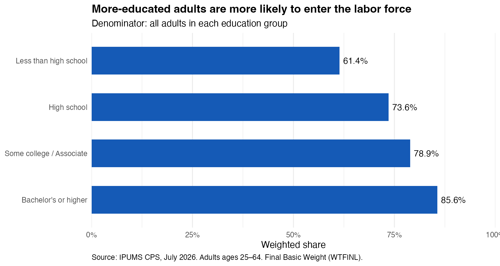
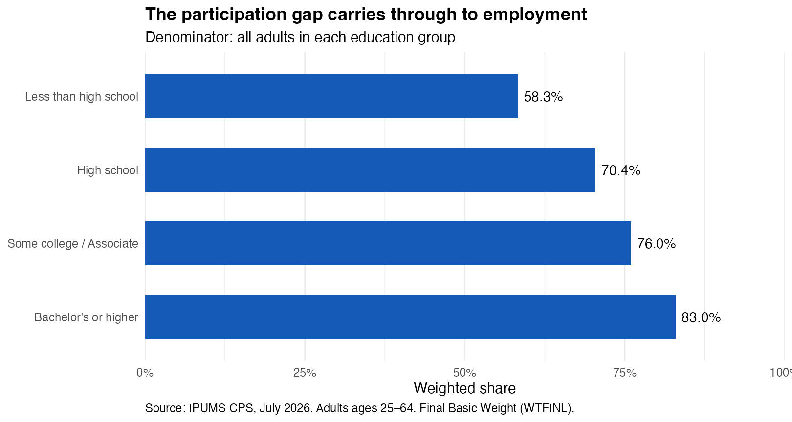
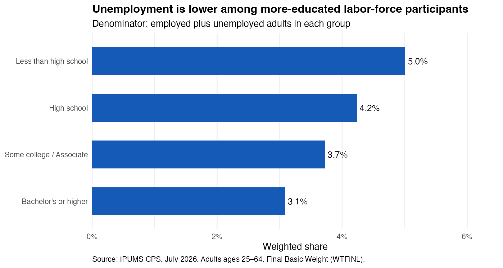

When people discuss education and employment, they often focus on the unemployment rate. But that statistic leaves out people who are neither working nor actively participating in the labor market. A group can have relatively low unemployment while many of its members remain outside the labor force. To understand the relationship between education and work, we need to ask a broader question: how do participation, employment, and unemployment differ across education levels?

This matters because being employed and being unemployed are not the only possible outcomes for working-age adults. Some are studying, caring for family members, retired, or unable to work. Those situations have different implications from searching unsuccessfully for a job. Looking at all three measures helps distinguish a gap in labor-market participation from a gap in finding employment among participants.

I use the July 2026 Basic Monthly Current Population Survey obtained through [IPUMS CPS](https://cps.ipums.org/cps/). The analysis covers civilian adults ages 25–64 in four education groups, using the final basic person weight so estimates describe the population represented by the survey rather than treating every sampled person equally. The retained sample contains 44,881 respondents. These are one-month descriptive estimates, without seasonal adjustment.

The first figure asks who is in the labor force: people who are employed or classified as unemployed. Participation rose from 61.4% among adults without a high school diploma to 73.6% among high school graduates, 78.9% among those with some college or an associate degree, and 85.6% among those with a bachelor's degree or higher. The difference between the first and last groups was 24.2 percentage points.

That is a substantial difference in attachment to the labor market, but participation alone does not tell us how many people actually have jobs. We therefore turn to employment, keeping the same population denominator.

The second figure shows the share of all adults in each group who were employed. It rose from 58.3% in the lowest education group to 70.4%, 76.0%, and 83.0% in the next three groups. The 24.7-percentage-point employment gap was close to the participation gap. This suggests that much of the employment difference reflects whether adults are in the labor force at all, rather than only whether participants have found a job.

To examine that remaining distinction, the third figure changes the denominator. The unemployment rate is the share unemployed among employed and unemployed adults, excluding people outside the labor force.

Unemployment fell from 5.0% among participants without a high school diploma to 4.2% for high school graduates, 3.7% for those with some college or an associate degree, and 3.1% for those with a bachelor's degree or higher. More-educated adults therefore had both higher participation and lower unemployment among participants. However, the 1.9-percentage-point unemployment gap was much smaller than the participation gap.

The three figures fit together through a simple relationship: the employment share equals the participation rate multiplied by one minus the unemployment rate. For the lowest education group, $0.614\times(1-0.050)$ is approximately 0.583. Someone outside the labor force lowers the participation and employment shares but does not enter the unemployment-rate denominator. This is why unemployment alone cannot describe the full education gap in employment.

These patterns do not establish that education caused the differences. Education groups can differ in age, health, family responsibilities, location, work experience, and other characteristics. The estimates also combine detailed education categories and describe one month, so they do not reveal long-run trends or whether small differences are statistically significant. The much larger descriptive gaps still show why a single headline unemployment rate gives an incomplete picture.

- Employment rose from 58.3% to 83.0% across the lowest and highest education groups.
- The largest difference was in participation: whether adults were in the labor force at all.
- Lower unemployment among more-educated participants reinforced that pattern, but the comparison is descriptive rather than causal.

Source: IPUMS CPS, University of Minnesota, July 2026 Basic Monthly sample. See [weight documentation](https://cps.ipums.org/cps-action/variables/WTFINL) and [code, aggregate results, and replication instructions](https://github.com/ywang818-max/website/tree/main/blog/posts/post3).
