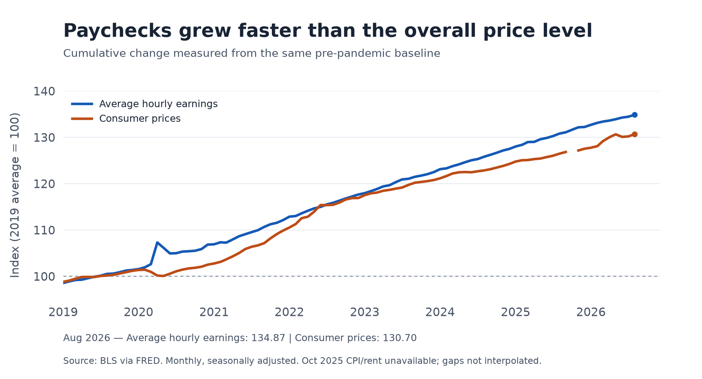
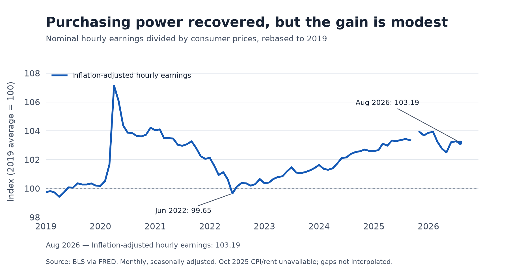
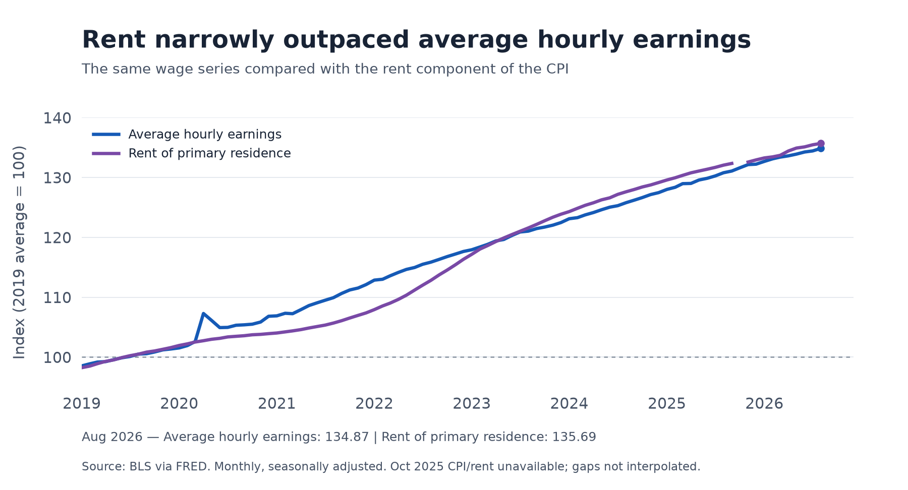

A bigger paycheck does not necessarily mean an easier month. When groceries, transportation, and rent also become more expensive, a raise can disappear before it improves a household's standard of living. This makes a practical question worth asking: since 2019, have U.S. wages kept up with consumer prices, and does the answer change when we focus on rent?

The distinction matters because slowing inflation does not mean prices have returned to their old level. Workers need wages to catch up with the accumulated increase in prices. Housing adds another complication: a household that spends heavily on rent may experience a different squeeze from the one suggested by an economy-wide average.

To investigate, I compare three monthly Bureau of Labor Statistics series obtained through FRED: average hourly earnings of all private-sector employees, the all-items Consumer Price Index (CPI), and the CPI for rent of primary residence. The analysis runs from January 2019 through August 2026, the latest month available for all three series when downloaded on October 6, 2026. All series are seasonally adjusted; missing October 2025 price observations are left as gaps. Each is expressed relative to its own 2019 average, set to 100, so different dollar and index units become comparable.

Figure 1 provides an encouraging first answer. By August 2026, average hourly earnings had risen 34.9% from their 2019 average, while consumer prices had risen 30.7%. Pay therefore grew faster than the overall price level across this period. However, the gap between these cumulative growth rates is not itself the percentage gain in purchasing power. Buying power depends on how wages compare with prices as a ratio.

Figure 2 makes that comparison directly by dividing the wage index by the price index and multiplying by 100. An index above 100 means the average hourly paycheck can buy more of the CPI basket than at the 2019 baseline. In August 2026, the index was 103.19: purchasing power was about 3.2% higher. The much larger nominal pay increase thus translated into a relatively modest real improvement.

The path was uneven. During the inflation surge, the real wage index fell to 99.65 in June 2022, its lowest reading since January 2021, before recovering. The sharp rise in 2020 needs particular care: average earnings can increase when lower-paid workers lose jobs and leave the measured workforce. It cannot be read as evidence that every worker received a large raise. This is a comparison of changing workforce averages, not a record of the same individuals over time.

That modest overall recovery leads to the next question: did wages also keep pace with a major recurring bill?

Figure 3 shows that rent rose 35.7% relative to its 2019 average, slightly more than the 34.9% increase in hourly earnings. Dividing wages by the rent index gives 99.39, meaning an average hour of work purchased about 0.6% less rental housing service than at the baseline. The difference is small, but it helps explain why an improvement in overall purchasing power need not imply an improvement against every essential expense.

This comparison does not measure a household's actual rent burden, which also depends on hours worked, household income, location, and housing choices. The rent CPI measures rental housing price changes; it is not a series of advertised rents for new leases. Likewise, the national CPI basket may differ from an individual household's spending. Rent is already included in the broader CPI, so Figure 3 examines a component rather than an additional cost to add on top.

The evidence answers the opening question with a qualified yes. Average private-sector hourly earnings exceeded the accumulated rise in overall consumer prices, but the real gain was modest, and rent narrowly outpaced wages.

- Average hourly pay rose 34.9%; consumer prices rose 30.7%.
- Overall hourly purchasing power was about 3.2% above the 2019 baseline.
- Rent rose 35.7%, leaving wage purchasing power against rent slightly below its baseline.

Source: U.S. Bureau of Labor Statistics via FRED, retrieved October 6, 2026. See [average hourly earnings](https://fred.stlouisfed.org/series/CES0500000003), [all-items CPI](https://fred.stlouisfed.org/series/CPIAUCSL), [rent CPI](https://fred.stlouisfed.org/series/CUSR0000SEHA), and [code, data, figures, and replication instructions](https://github.com/ywang818-max/website/tree/main/blog/posts/post4).
